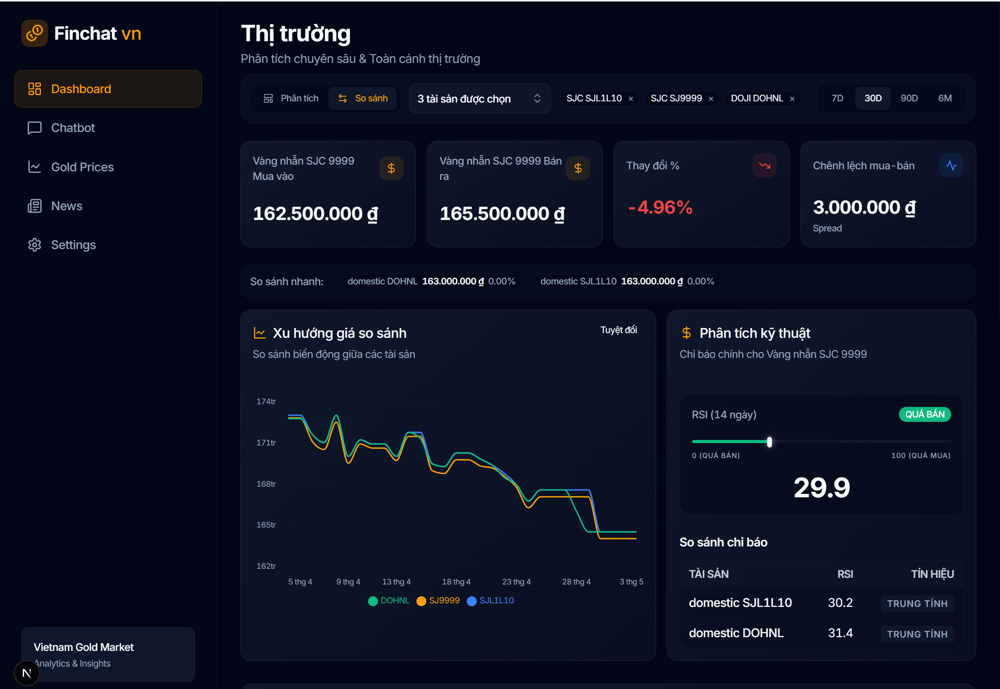

# FinChat VN — Vietnam Gold Market Analytics

AI-powered chatbot and analytics dashboard for the Vietnam gold market. Combines real-time price crawling, news aggregation with NLP sentiment analysis, and RAG-based conversational AI to deliver actionable market insights.



## Architecture

```
┌──────────────────────────────────────────────────────────┐
│                      Frontend (Next.js)                  │
│   Dashboard │ Chatbot │ Gold Prices │ News │ Settings    │
└──────────────────┬───────────────────────────────────────┘
                   │ REST API
┌──────────────────▼───────────────────────────────────────┐
│                   Backend (FastAPI)                       │
│                                                          │
│  ┌────────────┐  ┌──────────────┐  ┌──────────────────┐  │
│  │  Chatbot   │  │  Data Ingest │  │   Preprocessing  │  │
│  │ Orchestrator│  │  (Crawlers)  │  │   (Indicators)   │  │
│  └─────┬──────┘  └──────┬───────┘  └────────┬─────────┘  │
│        │                │                    │            │
│   ┌────▼────┐    ┌──────▼───────┐    ┌──────▼──────┐     │
│   │ Gemini  │    │  ClickHouse  │    │   Qdrant    │     │
│   │  LLM    │    │   (OLAP DB)  │    │ (Vector DB) │     │
│   └─────────┘    └──────────────┘    └─────────────┘     │
└──────────────────────────────────────────────────────────┘
                   │
         GitHub Actions (3x/day)
         Crawl → Preprocess → Index
```

## Project Structure

```
finchat-vn/
├── backend/                  # FastAPI backend
│   ├── api/                  # REST API routes
│   │   └── routes/           # price, news, chat endpoints
│   ├── chatbot/              # AI chatbot module
│   │   ├── orchestrator.py   # Main chat flow
│   │   ├── router.py         # Intent routing
│   │   ├── prompts/          # System prompts + domain knowledge
│   │   └── context_builder.py
│   ├── core/                 # Config, DB, LLM factory
│   ├── ingest/               # Data crawlers & parsers
│   │   ├── price/            # Gold price (vang.today API)
│   │   ├── news/             # News (VnExpress, Kitco, CafeF, Reuters)
│   │   └── market/           # XAUUSD, USDVND (Yahoo Finance)
│   ├── preprocessing/        # Technical indicators (EMA, RSI, MACD)
│   ├── rag/                  # Vector search & RAG pipeline
│   ├── tools/                # Price query tools for chatbot
│   ├── jobs/                 # Scheduled worker jobs
│   ├── tests/                # Unit tests
│   └── requirements.txt
├── frontend/                 # Next.js 16 frontend
│   └── src/
│       ├── app/              # Pages (dashboard, chat, prices, news)
│       ├── components/       # UI components
│       │   ├── chat/         # Chatbot UI (markdown, typing renderer)
│       │   ├── dashboard/    # KPI cards, charts, tables
│       │   ├── layout/       # Sidebar navigation
│       │   └── ui/           # shadcn/ui primitives
│       ├── hooks/            # Custom React hooks
│       └── lib/              # Types, utils, API client
├── .github/workflows/        # GitHub Actions pipeline
│   └── data-pipeline.yml     # 3x/day crawl schedule
├── Dockerfile                # Backend container
├── docker-compose.yml        # Local development
└── README.md
```

## Tech Stack

| Layer | Technology |
|-------|-----------|
| Frontend | Next.js 16, React 19, Tailwind CSS 4, shadcn/ui, Recharts |
| Backend | Python 3.13, FastAPI, Uvicorn |
| LLM | Google Gemini 2.5 Flash (via `google-generativeai`) |
| Database | ClickHouse Cloud (OLAP, time-series price data) |
| Vector DB | Qdrant Cloud (RAG embeddings for news) |
| Embeddings | `all-MiniLM-L6-v2` (sentence-transformers) |
| CI/CD | GitHub Actions (automated data pipeline) |
| Data Sources | vang.today, Yahoo Finance, VnExpress, Kitco, CafeF, Reuters |

## Getting Started

### Prerequisites

- Python 3.13+
- Node.js 18+
- ClickHouse Cloud account
- Qdrant Cloud account
- Google Gemini API key

### Backend

```bash
cd backend
python -m venv venv
source venv/bin/activate  # Windows: venv\Scripts\activate
pip install -r requirements.txt

# Copy and fill environment variables
cp .env.example .env
# Edit .env with your credentials

# Run dev server
uvicorn api.main:app --reload
```

### Frontend

```bash
cd frontend
npm install
npm run dev
```

App will be available at `http://localhost:3000`.

## Environment Variables

### Backend (`backend/.env`)

| Variable | Description |
|----------|-------------|
| `CLICKHOUSE_HOST` | ClickHouse Cloud host |
| `CLICKHOUSE_PORT` | ClickHouse port (8443 for Cloud) |
| `CLICKHOUSE_USER` | ClickHouse username |
| `CLICKHOUSE_PASSWORD` | ClickHouse password |
| `CLICKHOUSE_DATABASE` | Database name |
| `CLICKHOUSE_SECURE` | `true` for Cloud (HTTPS) |
| `LLM_PROVIDER` | `gemini` or `ollama` |
| `LLM_MODEL` | Model name (e.g. `gemini-2.5-flash`) |
| `GOOGLE_API_KEY` | Google Gemini API key |
| `QDRANT_URL` | Qdrant Cloud URL |
| `QDRANT_API_KEY` | Qdrant API key |
| `QDRANT_COLLECTION` | Collection name |
| `EMBEDDING_MODEL` | Sentence-transformer model name |

### Frontend (`frontend/.env.local`)

| Variable | Description |
|----------|-------------|
| `NEXT_PUBLIC_API_URL` | Backend API URL (default: `http://localhost:8000`) |

## Data Pipeline

The data pipeline runs automatically **3 times/day** via GitHub Actions (09:07, 13:07, 17:07 VN time):

1. **Crawl Gold Prices** — Fetch latest prices from vang.today + XAUUSD/USDVND from Yahoo Finance
2. **Crawl News** — Aggregate from VnExpress, Kitco, CafeF, Reuters
3. **Preprocess** — Compute technical indicators, NLP sentiment scoring
4. **Index to Qdrant** — Chunk and embed news articles for RAG

Pipeline can also be triggered manually via GitHub Actions `workflow_dispatch`.

## Features

- 📊 **Real-time Dashboard** — KPI cards, price trend charts, technical analysis (RSI, MACD, EMA)
- 🤖 **AI Chatbot** — Context-aware Q&A with domain knowledge injection and RAG
- 📰 **News Aggregation** — Multi-source news with sentiment analysis and impact scoring
- 📈 **Price Tracking** — 6 gold types + XAUUSD with historical comparison
- 🔄 **Automated Pipeline** — GitHub Actions for hands-free data updates

## License

This project is developed as part of a Machine Learning course project (Nhóm 18).
